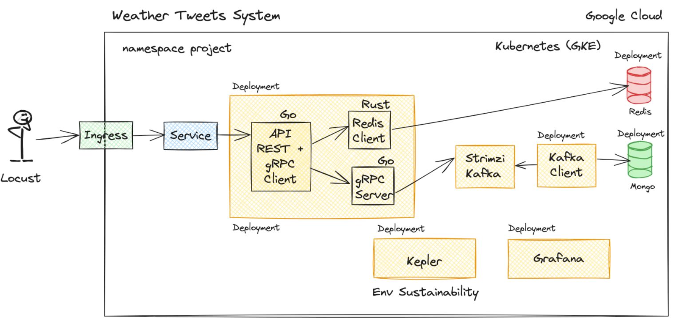

# Manual Técnico para la Implementación del Proyecto "2023 Weather Tweets" en Google Cloud Kubernetes

## Pasos para la Implementación

### 1. Configuración del Clúster de Kubernetes

1. Crea un clúster de Kubernetes en GCP.
2. Crear un namespace para el proyecto. `project`

### 3. Implementación de la API y otros Servicios

#### Los archivos asociados a la configuracion de despliegues de servicios en kubernetes son los siguietes en orden de la arquitectura implementada.

    go-api.yaml (Api Rest + gRPC client)
    go-server.yaml (gRPC server)
    rust-client-yaml (rust-client)
    redis.yaml (db-redis-server)
    grafana.yaml (grafana-redis)
    ingress.yaml (ingress)
    consumer.yaml (Kafka-consumer)
    kafka.yaml (kafka-producer)
    mongo.yaml (mongo-server)

### 4. Implementación de Redis y MongoDB

1. Crea un archivo de configuración para el despliegue de Redis y MongoDB.
2. Aplica la configuración para desplegar Redis y MongoDB en el clúster.

### 5. Implementación de Kafka con Strimzi

1. Instala Strimzi usando Helm para gestionar Kafka en Kubernetes.
2. Crea un archivo de configuración para el clúster de Kafka.
3. Aplica la configuración para desplegar Kafka en el clúster.

### 6. Implementación de Grafana

1. Instala Grafana usando Helm para la visualización de datos.
2. Configura Grafana para que acceda a los datos de Redis.

### 7. Implementación de Kepler

1. Instala Kepler usando Helm para monitorear el consumo de energía y emisiones de carbono.

### 8. Monitoreo y Pruebas

1. Monitorea el desempeño del sistema usando Grafana.
2. Verifica que los datos se almacenen correctamente en Redis y MongoDB.
3. Realiza pruebas de carga usando Locust.

### 9. Documentación y Entregables

1. Documenta todo el proceso y crea manuales técnicos y de usuario.
2. Sube el código fuente y la documentación a un repositorio de GitHub.

### Arquitectura empleada

---

**Referencias**

- [Kubernetes](https://kubernetes.io/)
- [gRPC](https://grpc.io/)
- [MongoDB](https://www.mongodb.com/)
- [Redis](https://redis.io/)
- [Strimzi Quickstarts](https://strimzi.io/quickstarts/)
- [Locust Documentation](https://docs.locust.io/en/stable/)
- [Covid Realtime Project](https://www.youtube.com/watch?v=IOMQ2ijkKQs)
- [gRPC Intro](https://www.youtube.com/watch?v=ftefB0t61w)
- [Confluent Kafka Go](https://github.com/confluentinc/confluent-kafka-go)
- [Kepler](https://sustainable-computing.io/)
